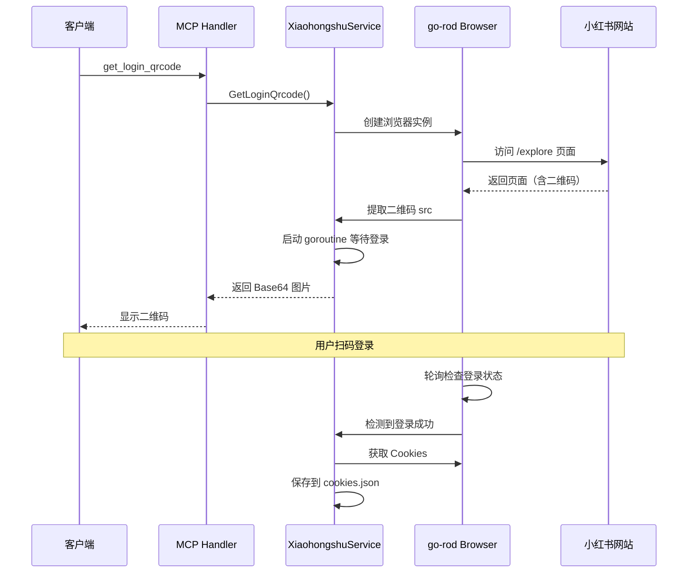
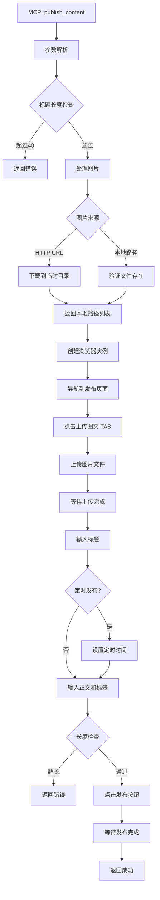
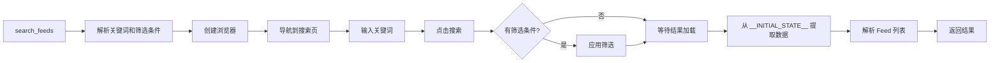

# xiaohongshu-mcp 项目架构文档

> 基于 [xiaohongshu-mcp](https://github.com/xpzouying/xiaohongshu-mcp) 的完整学习文档
> 创建时间：2025-02-27

---

## 目录

1. [项目概述](#1-项目概述)
2. [技术栈](#2-技术栈)
3. [目录结构](#3-目录结构)
4. [核心架构设计](#4-核心架构设计)
5. [核心流程分析](#5-核心流程分析)
6. [MCP 协议实现](#6-mcp-协议实现)
7. [HTTP API 实现](#7-http-api-实现)
8. [浏览器自动化](#8-浏览器自动化)
9. [数据流转图](#9-数据流转图)

---

## 1. 项目概述

**xiaohongshu-mcp** 是一个基于 Model Context Protocol (MCP) 的服务器，提供 AI 助手（如 Claude、Cursor、VS Code）与小红书平台之间的桥梁。

### 1.1 核心功能

| 功能模块 | 说明 |
|---------|------|
| 登录管理 | 二维码登录、登录状态检查、Cookie 管理 |
| 内容发布 | 图文发布、视频发布、定时发布 |
| 内容获取 | 推荐列表、搜索内容、帖子详情、评论加载 |
| 互动操作 | 点赞、收藏、评论、回复评论 |
| 用户信息 | 用户主页、当前用户信息 |

### 1.2 设计特点

- **双协议支持**：同时支持 MCP 协议和 HTTP REST API
- **浏览器自动化**：使用 go-rod 实现无头浏览器操作
- **会话保持**：通过 Cookie 文件持久化登录状态
- **模块化设计**：清晰的分层架构，易于扩展

---

## 2. 技术栈

### 2.1 核心依赖

```go
// MCP 协议官方 SDK
github.com/modelcontextprotocol/go-sdk/mcp

// Web 框架
github.com/gin-gonic/gin

// 浏览器自动化
github.com/go-rod/rod

// Cookie 管理
github.com/xpzouying/headless_browser

// 工具库
github.com/sirupsen/logrus          // 日志
github.com/mattn/go-runewidth       // 字符宽度计算
github.com/pkg/errors               // 错误处理
```

### 2.2 关键技术点

| 技术 | 用途 |
|------|------|
| MCP SDK | 实现 Model Context Protocol 服务器 |
| go-rod | Chrome DevTools Protocol，控制浏览器 |
| Gin | HTTP API 路由和处理 |
| JSON Schema | MCP 工具参数定义和验证 |

---

## 3. 目录结构

```
xiaohongshu-mcp/
├── main.go                 # 主入口，命令行参数解析
├── app_server.go           # 应用服务器，组合根
├── service.go              # 业务服务层，核心业务逻辑
├── mcp_server.go           # MCP 服务器初始化和工具注册
├── mcp_handlers.go         # MCP 工具处理函数
├── handlers_api.go         # HTTP API 处理器
├── routes.go               # 路由配置
├── middleware.go           # 中间件（CORS、错误处理）
├── types.go                # 通用类型定义
│
├── configs/                # 配置管理
│   ├── browser.go          # 浏览器配置
│   ├── image.go            # 图片配置
│   └── username.go         # 用户名配置
│
├── cookies/                # Cookie 管理
│   └── cookies.go          # Cookie 存储和加载
│
├── browser/                # 浏览器封装
│   └── browser.go          # 浏览器工厂函数
│
├── xiaohongshu/            # 小红书业务逻辑
│   ├── login.go            # 登录逻辑
│   ├── publish.go          # 图文发布
│   ├── publish_video.go    # 视频发布
│   ├── feeds.go            # Feed 列表
│   ├── search.go           # 搜索功能
│   ├── feed_detail.go      # 帖子详情
│   ├── comment_feed.go     # 评论功能
│   ├── like_favorite.go    # 点赞收藏
│   ├── user_profile.go     # 用户主页
│   ├── navigate.go         # 页面导航
│   └── types.go            # 数据结构定义
│
├── pkg/downloader/         # 图片下载器
│   ├── images.go           # 图片处理
│   ├── processor.go        # 下载处理器
│   └── images_test.go      # 测试
│
├── errors/                 # 错误处理
│   └── errors.go           # 自定义错误
│
├── cmd/login/              # 登录工具
│   └── main.go             # 独立登录程序
│
└── docs/                   # 文档
    ├── API.md              # API 文档
    └── windows_guide.md    # Windows 指南
```

---

## 4. 核心架构设计

### 4.1 分层架构

```
┌─────────────────────────────────────────────────────────────┐
│                      客户端层                                │
│    (Claude Code / Cursor / VSCode / Inspector / 其他)        │
└───────────────────────┬─────────────────────────────────────┘
                        │
                        ▼
┌─────────────────────────────────────────────────────────────┐
│                    传输层 (Transport)                        │
│   ┌───────────────┐            ┌───────────────────┐        │
│   │  MCP 协议      │            │  HTTP REST API    │        │
│   │  /mcp 端点     │            │  /api/v1/*        │        │
│   └───────┬───────┘            └─────────┬─────────┘        │
└───────────┼──────────────────────────────┼──────────────────┘
            │                              │
            ▼                              ▼
┌─────────────────────────────────────────────────────────────┐
│                   协议层 (Protocol)                          │
│   ┌─────────────────────────────────────────────────────┐   │
│   │              MCP Server (Official SDK)               │   │
│   │  - 13 个工具 (Tools)                                 │   │
│   │  - JSON Schema 参数验证                              │   │
│   │  - Streamable HTTP 支持                              │   │
│   └─────────────────────────────────────────────────────┘   │
└───────────────────────┬─────────────────────────────────────┘
                        │
                        ▼
┌─────────────────────────────────────────────────────────────┐
│                  处理器层 (Handlers)                         │
│   ┌────────────────┐          ┌──────────────────┐          │
│   │ MCP Handlers   │          │  HTTP Handlers   │          │
│   │ - 参数解析     │          │  - 请求验证      │          │
│   │ - 格式转换     │          │  - JSON 绑定     │          │
│   │ - 调用 Service │          │  - 调用 Service  │          │
│   └────────┬───────┘          └─────────┬────────┘          │
└────────────┼────────────────────────────┼───────────────────┘
             │                            │
             └────────────┬───────────────┘
                          │
                          ▼
┌─────────────────────────────────────────────────────────────┐
│                   服务层 (Service)                           │
│   ┌──────────────────────────────────────────────────────┐  │
│   │              XiaohongshuService                      │  │
│   │  - 业务编排                                          │  │
│   │  - 参数校验                                          │  │
│   │  - 错误处理                                          │  │
│   │  - 创建浏览器实例                                    │  │
│   └──────────────────────┬───────────────────────────────┘  │
└──────────────────────────┼──────────────────────────────────┘
                           │
                           ▼
┌─────────────────────────────────────────────────────────────┐
│                  业务逻辑层 (Domain)                         │
│   ┌─────────┐ ┌─────────┐ ┌─────────┐ ┌──────────────┐      │
│   │ Login   │ │ Publish │ │  Feeds  │ │   Comments   │      │
│   │ Action  │ │ Action  │ │ Actions │ │   Action     │      │
│   └────┬────┘ └────┬────┘ └────┬────┘ └──────┬───────┘      │
└────────┼────────────┼────────────┼──────────────┼───────────┘
         │            │            │              │
         └────────────┴────────────┴──────────────┘
                                  │
                                  ▼
┌─────────────────────────────────────────────────────────────┐
│               基础设施层 (Infrastructure)                     │
│   ┌──────────────┐  ┌──────────────┐  ┌──────────────┐     │
│   │  Browser     │  │   Cookies    │  │  Downloader  │     │
│   │  (go-rod)    │  │  存储/加载   │  │  图片下载    │     │
│   └──────────────┘  └──────────────┘  └──────────────┘     │
└─────────────────────────────────────────────────────────────┘
```

### 4.2 组合根模式

```go
// app_server.go - 组合根
type AppServer struct {
    xiaohongshuService *XiaohongshuService  // 业务服务
    mcpServer          *mcp.Server          // MCP 服务器
    router             *gin.Engine          // HTTP 路由
    httpServer         *http.Server         // HTTP 服务器
}

// main.go - 依赖注入
func main() {
    // 1. 初始化服务层
    xiaohongshuService := NewXiaohongshuService()

    // 2. 创建应用服务器（注入服务）
    appServer := NewAppServer(xiaohongshuService)

    // 3. 启动服务器
    appServer.Start(":18060")
}
```

---

## 5. 核心流程分析

### 5.1 登录流程



**关键代码：**

```go
// xiaohongshu/login.go
func (a *LoginAction) FetchQrcodeImage(ctx context.Context) (string, bool, error) {
    pp := a.page.Context(ctx)
    pp.MustNavigate("https://www.xiaohongshu.com/explore").MustWaitLoad()
    time.Sleep(2 * time.Second)

    // 检查是否已登录
    if exists, _, _ := pp.Has(".main-container .user .link-wrapper .channel"); exists {
        return "", true, nil
    }

    // 获取二维码
    src, err := pp.MustElement(".login-container .qrcode-img").Attribute("src")
    return *src, false, nil
}

func (a *LoginAction) WaitForLogin(ctx context.Context) bool {
    ticker := time.NewTicker(500 * time.Millisecond)
    defer ticker.Stop()

    for {
        select {
        case <-ctx.Done():
            return false
        case <-ticker.C:
            // 检查登录成功元素
            el, err := pp.Element(".main-container .user .link-wrapper .channel")
            if err == nil && el != nil {
                return true
            }
        }
    }
}
```

### 5.2 发布图文流程



**关键代码：**

```go
// service.go
func (s *XiaohongshuService) PublishContent(ctx context.Context, req *PublishRequest) (*PublishResponse, error) {
    // 1. 标题长度校验
    if titleWidth := runewidth.StringWidth(req.Title); titleWidth > 40 {
        return nil, fmt.Errorf("标题长度超过限制")
    }

    // 2. 处理图片（下载或使用本地）
    imagePaths, err := s.processImages(req.Images)
    if err != nil {
        return nil, err
    }

    // 3. 构建发布内容
    content := xiaohongshu.PublishImageContent{
        Title:        req.Title,
        Content:      req.Content,
        Tags:         req.Tags,
        ImagePaths:   imagePaths,
        ScheduleTime: scheduleTime,
    }

    // 4. 执行发布
    if err := s.publishContent(ctx, content); err != nil {
        return nil, err
    }

    return &PublishResponse{...}, nil
}
```

### 5.3 搜索内容流程



---

## 6. MCP 协议实现

### 6.1 MCP 工具注册

```go
// mcp_server.go
func InitMCPServer(appServer *AppServer) *mcp.Server {
    // 创建 MCP Server
    server := mcp.NewServer(&mcp.Implementation{
        Name:    "xiaohongshu-mcp",
        Version: "2.0.0",
    }, nil)

    // 注册所有工具
    registerTools(server, appServer)

    return server
}

func registerTools(server *mcp.Server, appServer *AppServer) {
    // 工具 1: 检查登录状态
    mcp.AddTool(server, &mcp.Tool{
        Name:        "check_login_status",
        Description: "检查小红书登录状态",
        Annotations: &mcp.ToolAnnotations{
            Title:        "Check Login Status",
            ReadOnlyHint: true,
        },
    }, withPanicRecovery("check_login_status",
        func(ctx context.Context, req *mcp.CallToolRequest, _ any) (*mcp.CallToolResult, any, error) {
            result := appServer.handleCheckLoginStatus(ctx)
            return convertToMCPResult(result), nil, nil
        }),
    )

    // ... 注册其他 12 个工具

    logrus.Infof("Registered %d MCP tools", 13)
}
```

### 6.2 工具参数定义

使用 Go 结构体 + JSON Schema 标签：

```go
type PublishContentArgs struct {
    Title      string   `json:"title" jsonschema:"内容标题（小红书限制：最多20个中文字）"`
    Content    string   `json:"content" jsonschema:"正文内容，不包含以#开头的标签"`
    Images     []string `json:"images" jsonschema:"图片路径列表（至少1张）"`
    Tags       []string `json:"tags,omitempty" jsonschema:"话题标签列表"`
    ScheduleAt string   `json:"schedule_at,omitempty" jsonschema:"定时发布时间（可选）"`
}

type FeedDetailArgs struct {
    FeedID           string `json:"feed_id" jsonschema:"小红书笔记ID"`
    XsecToken        string `json:"xsec_token" jsonschema:"访问令牌"`
    LoadAllComments  bool   `json:"load_all_comments,omitempty" jsonschema:"是否加载全部评论"`
    Limit            int    `json:"limit,omitempty" jsonschema:"限制加载的一级评论数量"`
    ClickMoreReplies bool   `json:"click_more_replies,omitempty" jsonschema:"是否展开二级回复"`
}
```

### 6.3 MCP 工具列表

| 序号 | 工具名 | 描述 | 参数 |
|-----|-------|------|------|
| 1 | `check_login_status` | 检查登录状态 | 无 |
| 2 | `get_login_qrcode` | 获取登录二维码 | 无 |
| 3 | `delete_cookies` | 删除 cookies 重置登录 | 无 |
| 4 | `publish_content` | 发布图文 | title, content, images, tags?, schedule_at? |
| 5 | `publish_with_video` | 发布视频 | title, content, video, tags?, schedule_at? |
| 6 | `list_feeds` | 获取推荐列表 | 无 |
| 7 | `search_feeds` | 搜索内容 | keyword, filters? |
| 8 | `get_feed_detail` | 获取帖子详情 | feed_id, xsec_token, load_all_comments?, ... |
| 9 | `user_profile` | 获取用户主页 | user_id, xsec_token |
| 10 | `post_comment_to_feed` | 发表评论 | feed_id, xsec_token, content |
| 11 | `reply_comment_in_feed` | 回复评论 | feed_id, xsec_token, comment_id/user_id, content |
| 12 | `like_feed` | 点赞/取消点赞 | feed_id, xsec_token, unlike? |
| 13 | `favorite_feed` | 收藏/取消收藏 | feed_id, xsec_token, unfavorite? |

---

## 7. HTTP API 实现

### 7.1 路由配置

```go
// routes.go
func setupRoutes(appServer *AppServer) *gin.Engine {
    router := gin.New()
    router.Use(gin.Logger(), gin.Recovery())
    router.Use(errorHandlingMiddleware(), corsMiddleware())

    // 健康检查
    router.GET("/health", healthHandler)

    // MCP 端点
    mcpHandler := mcp.NewStreamableHTTPHandler(
        func(r *http.Request) *mcp.Server {
            return appServer.mcpServer
        },
        &mcp.StreamableHTTPOptions{JSONResponse: true},
    )
    router.Any("/mcp", gin.WrapH(mcpHandler))
    router.Any("/mcp/*path", gin.WrapH(mcpHandler))

    // REST API
    api := router.Group("/api/v1")
    {
        // 登录管理
        api.GET("/login/status", appServer.checkLoginStatusHandler)
        api.GET("/login/qrcode", appServer.getLoginQrcodeHandler)
        api.DELETE("/login/cookies", appServer.deleteCookiesHandler)

        // 发布
        api.POST("/publish", appServer.publishHandler)
        api.POST("/publish_video", appServer.publishVideoHandler)

        // Feed
        api.GET("/feeds/list", appServer.listFeedsHandler)
        api.GET("/feeds/search", appServer.searchFeedsHandler)
        api.POST("/feeds/search", appServer.searchFeedsHandler)
        api.POST("/feeds/detail", appServer.getFeedDetailHandler)

        // 用户
        api.POST("/user/profile", appServer.userProfileHandler)
        api.GET("/user/me", appServer.myProfileHandler)

        // 评论
        api.POST("/feeds/comment", appServer.postCommentHandler)
        api.POST("/feeds/comment/reply", appServer.replyCommentHandler)
    }

    return router
}
```

### 7.2 统一响应格式

```go
// 成功响应
type SuccessResponse struct {
    Success bool   `json:"success"`
    Data    any    `json:"data"`
    Message string `json:"message,omitempty"`
}

// 错误响应
type ErrorResponse struct {
    Error   string `json:"error"`
    Code    string `json:"code"`
    Details any    `json:"details,omitempty"`
}
```

---

## 8. 浏览器自动化

### 8.1 go-rod 核心概念

```go
// browser/browser.go
func NewBrowser(headless bool, opts ...BrowserOption) *headless_browser.Browser {
    // 使用封装的浏览器工厂
}

// service.go - 浏览器使用模式
func (s *XiaohongshuService) someMethod() {
    b := newBrowser()      // 创建浏览器
    defer b.Close()         // 确保关闭

    page := b.NewPage()     // 创建页面
    defer page.Close()      // 确保关闭

    // 执行操作...
}
```

### 8.2 页面操作模式

```go
// 导航
page.MustNavigate("https://www.xiaohongshu.com/explore").MustWaitLoad()

// 等待元素
element := page.MustElement(".selector")

// 输入内容
element.MustInput("text")

// 点击
element.MustClick(proto.InputMouseButtonLeft, 1)

// 检查元素存在
exists, elem, err := page.Has(".selector")

// 执行 JavaScript
result := page.Eval("() => { return document.title }")

// 上传文件
uploadInput.MustSetFiles("/path/to/file.jpg")
```

### 8.3 选择器策略

```go
// CSS 选择器
page.MustElement(".login-container .qrcode-img")
page.MustElement("div.upload-content")
page.MustElement("#creator-editor-topic-container")

// 属性选择器
page.Element("[data-placeholder='输入正文']")

// 文本内容查找
elements := page.MustElements("p")
for _, elem := range elements {
    text, _ := elem.Text()
    if strings.Contains(text, "目标文本") {
        // 找到元素
    }
}
```

### 8.4 等待策略

```go
// 等待页面加载
page.MustWaitLoad()

// 等待 DOM 稳定
page.MustWaitDOMStable(time.Second, 0.1)

// 等待元素可见
page.MustElement(".selector").MustWaitVisible()

// 自定义轮询等待
for time.Now().Before(deadline) {
    if exists, _, _ := page.Has(".selector"); exists {
        return
    }
    time.Sleep(200 * time.Millisecond)
}

// Race 模式（多个条件竞争）
page.Race().
    Element("div.ql-editor").MustHandle(func(e *rod.Element) {
        // 找到第一个元素
    }).
    ElementFunc(func(page *rod.Page) (*rod.Element, error) {
        return findTextboxByPlaceholder(page)
    }).MustHandle(func(e *rod.Element) {
        // 找到第二个元素
    }).
    MustDo()
```

---

## 9. 数据流转图

### 9.1 发布图文数据流

```
┌─────────────┐
│   Claude    │ "帮我发布一篇关于春天的帖子到小红书"
│   Client    │
└──────┬──────┘
       │ MCP 请求
       ▼
┌─────────────────────────────────────────────────────────┐
│                    MCP Handler                          │
│  1. 解析参数：title, content, images, tags              │
│  2. 调用 XiaohongshuService.PublishContent()           │
└────────────────────┬────────────────────────────────────┘
                     │
                     ▼
┌─────────────────────────────────────────────────────────┐
│              XiaohongshuService                        │
│  1. 标题长度校验 (runewidth.StringWidth)               │
│  2. 处理图片：                                         │
│     - HTTP URL → 下载到临时目录                         │
│     - 本地路径 → 验证存在                              │
│  3. 构建 PublishImageContent                           │
└────────────────────┬────────────────────────────────────┘
                     │
                     ▼
┌─────────────────────────────────────────────────────────┐
│                PublishAction                           │
│  1. 创建 go-rod 浏览器实例                             │
│  2. 导航到 creator.xiaohongshu.com/publish            │
│  3. 点击"上传图文" TAB                                 │
│  4. 上传图片文件                                       │
│  5. 等待上传完成（轮询 .img-preview-area .pr 计数）   │
│  6. 输入标题                                           │
│  7. 输入正文和标签                                     │
│  8. 检查长度限制                                       │
│  9. 点击发布按钮                                       │
└────────────────────┬────────────────────────────────────┘
                     │
                     ▼
┌─────────────────────────────────────────────────────────┐
│              小红书网站 (DOM 操作)                      │
│  - .upload-input → SetFiles()                          │
│  - div.d-input input → Input(title)                    │
│  - div.ql-editor → Input(content)                      │
│  - .publish-page-publish-btn button → Click()          │
└────────────────────┬────────────────────────────────────┘
                     │
                     ▼
                返回发布结果
```

### 9.2 Cookie 管理流程

```
┌──────────────┐
│ 首次登录     │
└──────┬───────┘
       │
       ▼
┌─────────────────────────────────────────────┐
│  get_login_qrcode                           │
│  1. 打开浏览器访问小红书                     │
│  2. 提取二维码图片返回                       │
│  3. 启动 goroutine 轮询登录状态             │
└──────────────┬──────────────────────────────┘
               │ 用户扫码
               ▼
         ┌──────────┐
         │ 登录成功 │
         └────┬─────┘
              │
              ▼
┌─────────────────────────────────────────────┐
│  WaitForLogin()                             │
│  1. 检测到 .main-container .user ... 元素   │
│  2. 调用 page.Browser().GetCookies()       │
│  3. JSON 序列化 Cookies                     │
│  4. 保存到 cookies.json                     │
└─────────────────────────────────────────────┘

┌──────────────┐
│ 后续请求     │
└──────┬───────┘
       │
       ▼
┌─────────────────────────────────────────────┐
│  newBrowser()                               │
│  1. 检查 cookies.json 是否存在              │
│  2. 如果存在，加载并设置到浏览器            │
│  3. 浏览器自动携带 Cookie 访问页面          │
└─────────────────────────────────────────────┘
```

---

## 10. 关键设计模式

### 10.1 依赖注入

```go
// 组合根
func NewAppServer(xiaohongshuService *XiaohongshuService) *AppServer {
    appServer := &AppServer{
        xiaohongshuService: xiaohongshuService,
    }
    appServer.mcpServer = InitMCPServer(appServer)
    return appServer
}
```

### 10.2 工厂模式

```go
// browser/browser.go
func NewBrowser(headless bool, opts ...BrowserOption) *headless_browser.Browser

// xiaohongshu/*.go
func NewLogin(page *rod.Page) *LoginAction
func NewPublishImageAction(page *rod.Page) (*PublishAction, error)
func NewSearchAction(page *rod.Page) *SearchAction
```

### 10.3 策略模式

```go
// 图片处理策略
func (s *XiaohongshuService) processImages(images []string) ([]string, error) {
    processor := downloader.NewImageProcessor()
    return processor.ProcessImages(images)  // 自动识别 URL 或本地路径
}
```

### 10.4 错误包装

```go
import "github.com/pkg/errors"

// 在各层包装错误
return errors.Wrap(err, "小红书上传图片失败")
return errors.Wrap(err, "获取 Feed 详情失败")

// 在顶层获取完整调用栈
```

---

## 11. 配置管理

### 11.1 环境变量

```bash
# 浏览器二进制路径
ROD_BROWSER_BIN=/path/to/chrome

# Cookie 存储路径
COOKIES_PATH=./cookies.json

# 服务器端口（默认 :18060）
PORT=:8080
```

### 11.2 命令行参数

```bash
# 无头模式（默认）
./xiaohongshu-mcp

# 非无头模式（显示浏览器）
./xiaohongshu-mcp -headless=false

# 指定端口
./xiaohongshu-mcp -port=:8080

# 指定浏览器路径
./xiaohongshu-mcp -bin=/Applications/Google\ Chrome.app/Contents/MacOS/Google\ Chrome
```

---

## 总结

**xiaohongshu-mcp** 的核心设计理念：

1. **清晰的分层**：传输层 → 协议层 → 处理器层 → 服务层 → 业务层 → 基础设施层
2. **模块化**：每个功能模块独立，易于测试和维护
3. **双协议支持**：MCP 用于 AI 集成，HTTP API 用于传统调用
4. **浏览器自动化**：通过 go-rod 精确控制页面元素
5. **会话保持**：Cookie 持久化避免重复登录

这个架构可以作为开发其他平台 MCP 服务器（如 heybox-mcp）的参考模板。
